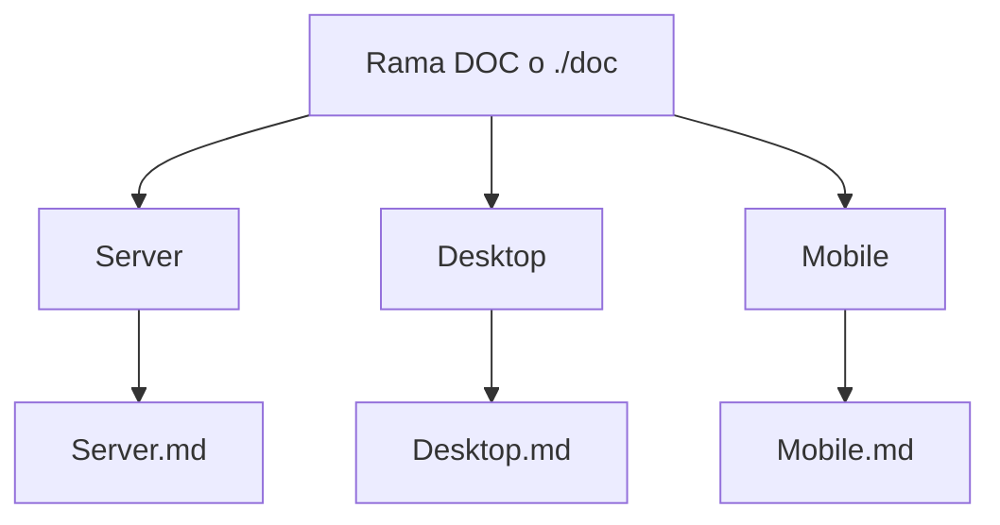

# Documentación

La documentación está distribuida en la carpeta "doc" con el nombre de cada carpeta

## Estructura de Documentos:

```mermaid
flowchart TD
    Z[Rama DOC o ./doc] --> A
    Z[Rama DOC o ./doc] --> C
    Z[Rama DOC o ./doc] --> E
    A[Server] --> B[Server.md]
    C[Desktop] --> D[Desktop.md]
    E[Mobile] --> F[Mobile.md]
```
